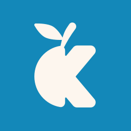

 
<h1>Korange's Site (2026)</h1>

## ✨️ Features
- Profile and social links
- Blog functionality
  - Uses emojis as eye-catching images
- Supports [NIP-05](https://github.com/nostr-protocol/nips/blob/master/05.md)
- Supports Web Key Directory
  - Can serve public keys for GnuPG from this site
- Aggregates articles written on other platforms
  - Currently manual addition, but automation using RSS is planned
- Timeline page to view activities
- Smooth animations
- Multilingual support (Japanese and English)
- Admin authentication/Admin dashboard
- etc

### 💻️ Features in Development

As soon as these are finished, I'll integrate them with the [current site](https://korange.work/).

- Contact form
- Email display button with CAPTCHA for spam protection
- Donation page (Page exists, but the recipient is undecided)
- License page (License has not been decided yet)
- Like and comment functionality for articles
- URL shortening service (Struggling with how to implement analytics)
- Enhancing content for the Work page
- etc

## 🛠️ Technology
- TypeScript
- Next.js (App Router)
  - Considering a migration to vinext
- Tailwind CSS
- Better Auth (For Admin page authentication)
- Prisma (for database access)
  - Features requiring a database are currently WIP

## AI Usage

This section describes the AI/LLM tools used during development and how they were utilized.

- ChatGPT, Claude
  - Primarily used for questions regarding implementation approaches (especially those specific to Next.js) without directly access the codebase.
  - Examples:
    - "How can I run a script on all pages in Next.js?"
    - "What is a good implementation method for structuring flat DB data where `replyTo` points to other element IDs into a nested `replies` structure?"
    - "What is a good approach for handling both structures like locale/slug/index.mdx and locale/slug.mdx in content-collections?"
  - Also used for troubleshooting errors.
- GitHub Copilot
  - Used for code completion in VSCode.
- Others
  - Used LLM-based translation tools for some text localization and Devlog translations.
