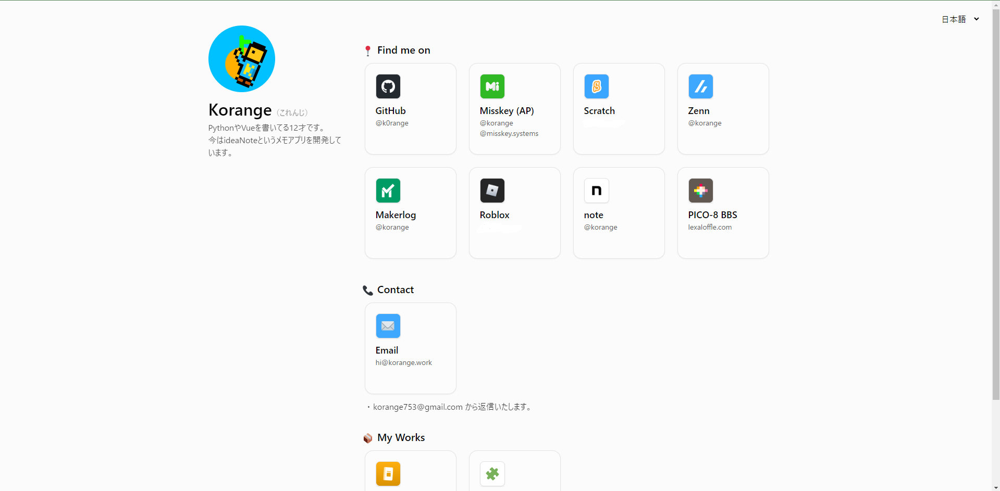
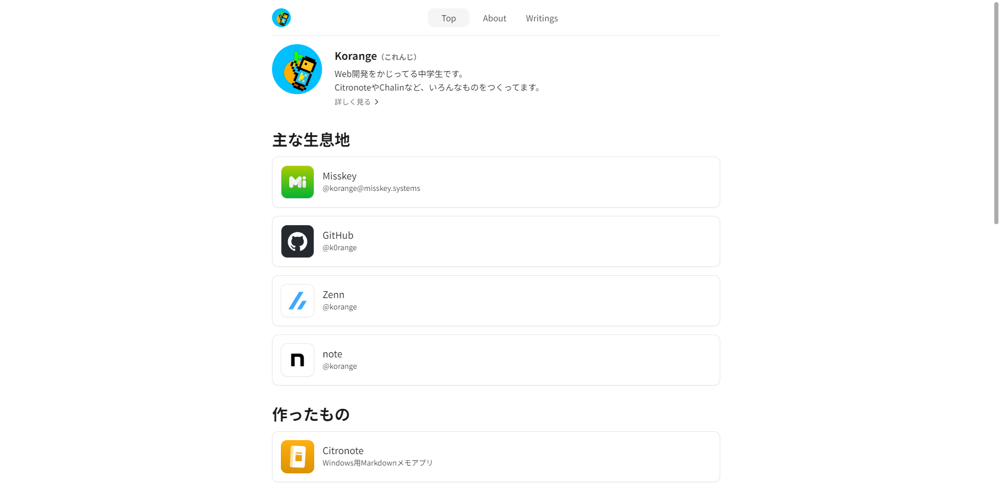
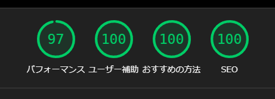
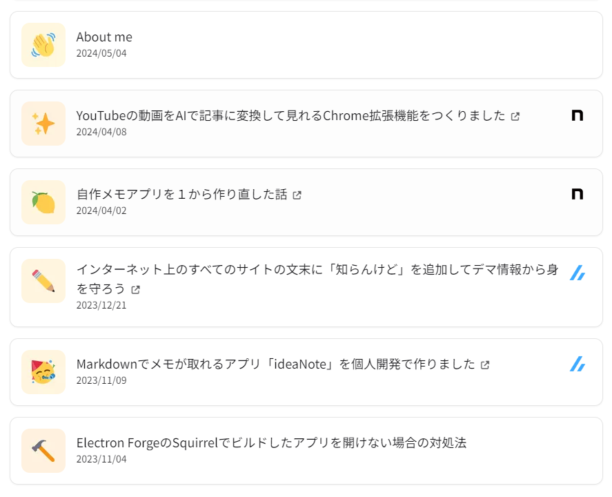

このサイト（korange.work）をリニューアルしました。

## 以前のサイトとの比較

【以前のサイト】

【新しくなったサイト】

## ２カラムから１カラムに
前のサイトでは左にプロフィール、右にリンク集だったのを新しいサイトでは１カラムにしました。

## フレームワーク
以前のサイトではVueを使ってサイトを作っていましたが、パフォーマンスを早くするために新しいサイトではAstroを採用してみました。

結果、前のサイトではLighthouseのパフォーマンスが76だったのが、97になりました。

ギリギリ100は行きませんでしたが、概ね満足の結果です。

## デプロイ環境・バージョン管理
前のサイトではGitを使っていなかったですが、新しいサイトではGitでバージョン管理をしています。

変更がGitHubにpushされると、Cloudflare Pagesが自動でビルドコマンドを叩いてデプロイしてくれるようになっています。

## 記事ページを追加
ブログ機能を追加しました。暇なときに記事を書いていこうと思います。

Writingsページでは、このサイトで書いた記事以外にも他のサイト（Zenn・noteなど）で書いた記事も表示されるようになっています。

また、記事のアイキャッチには絵文字を使っています。これはサイトの統一感を高めるためと、単純にZennの絵文字アイキャッチが気に入ったからです。

### コメント欄・いいねボタン
ブログページの下にはgiscusのコメント欄といいねボタン・シェアボタンを設置しました。よかったら試してみてください。